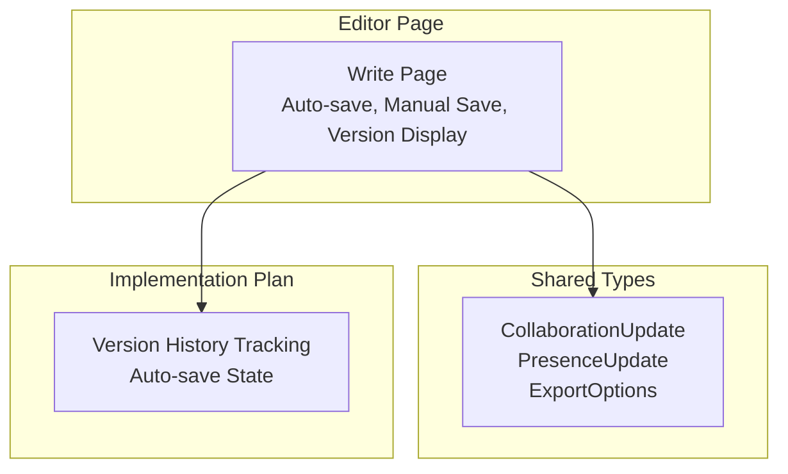
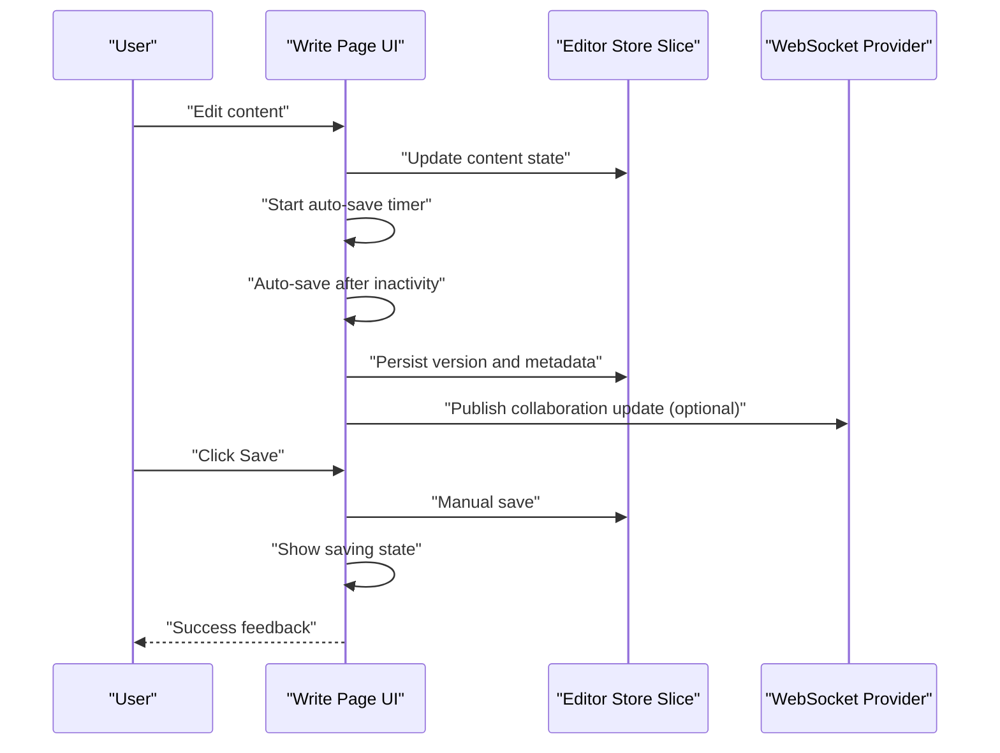
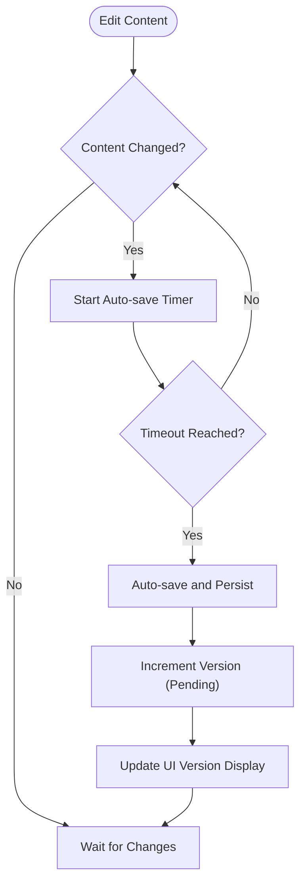
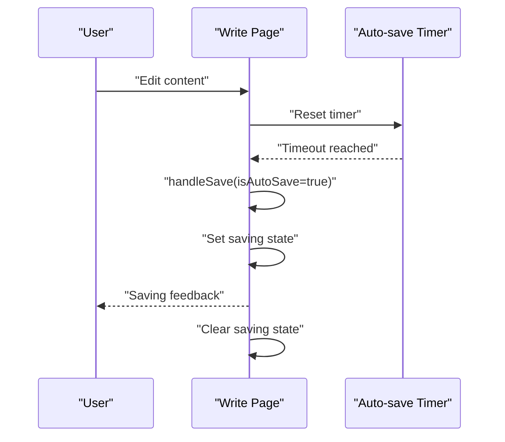
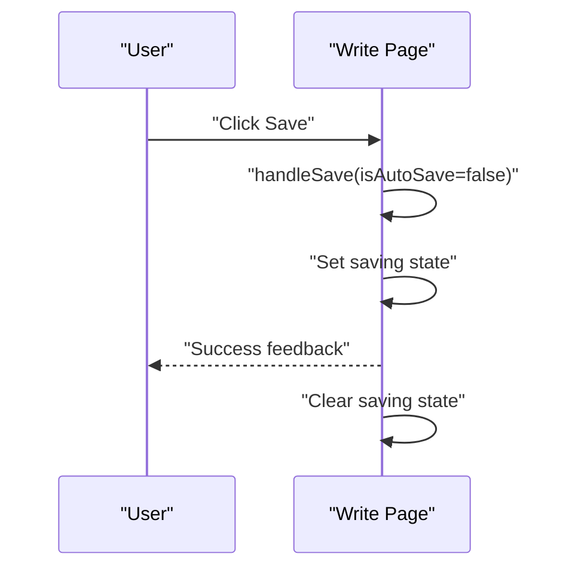
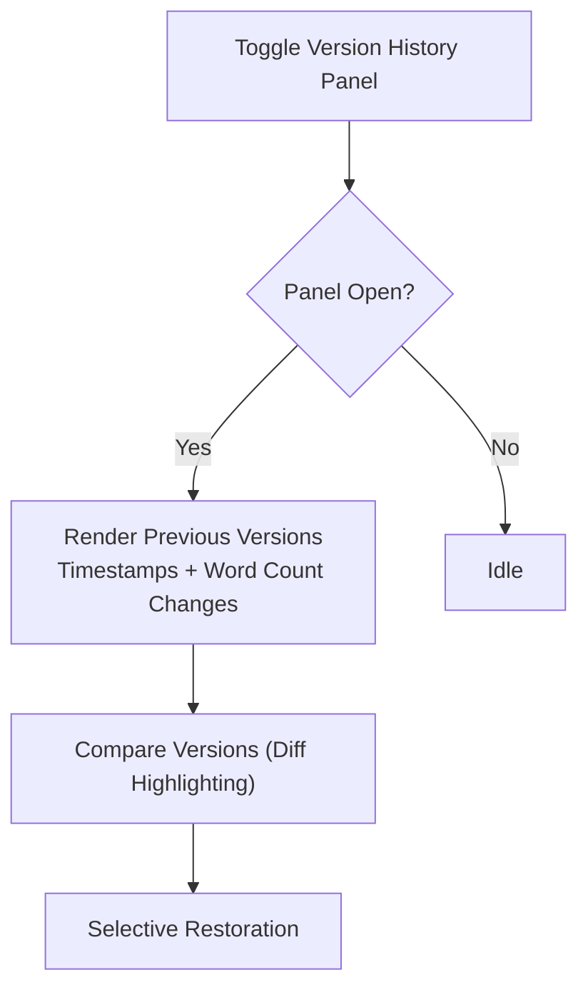
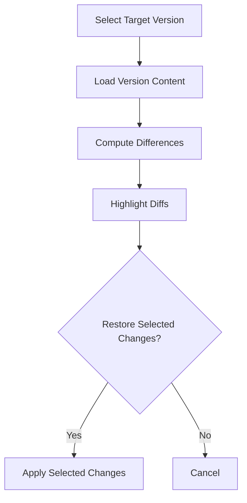
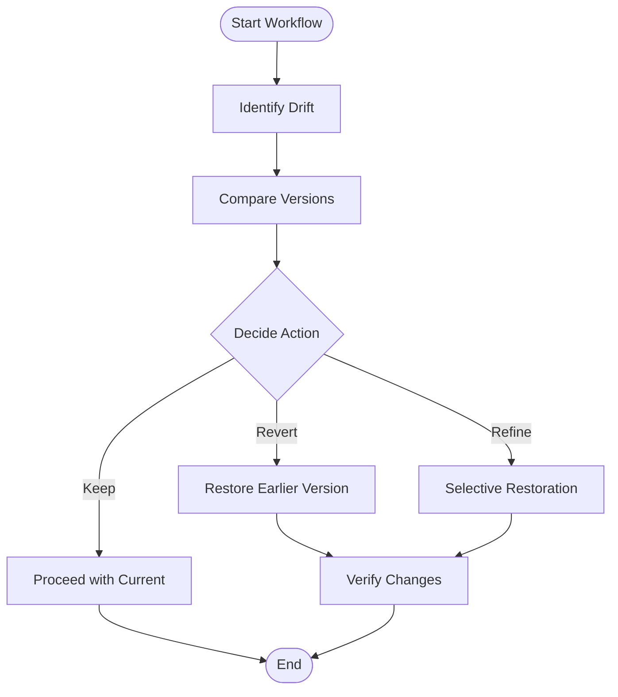
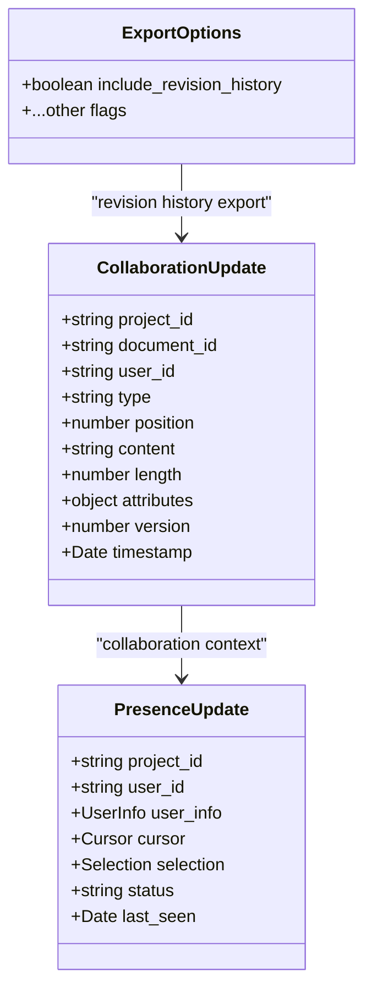
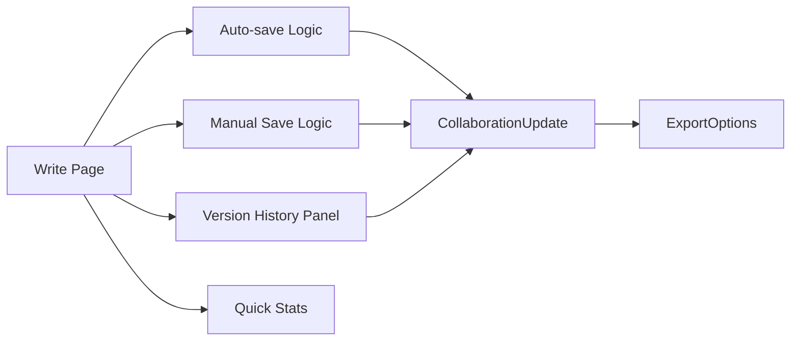

# Version Control & History

<cite>
**Referenced Files in This Document**
- [page.tsx](file://src/app/projects/[id]/write/page.tsx)
- [api.ts](file://packages/shared-types/src/api.ts)
- [IMPLEMENTATION_PLAN.md](file://IMPLEMENTATION_PLAN.md)
</cite>

## Table of Contents
1. [Introduction](#introduction)
2. [Project Structure](#project-structure)
3. [Core Components](#core-components)
4. [Architecture Overview](#architecture-overview)
5. [Detailed Component Analysis](#detailed-component-analysis)
6. [Dependency Analysis](#dependency-analysis)
7. [Performance Considerations](#performance-considerations)
8. [Troubleshooting Guide](#troubleshooting-guide)
9. [Conclusion](#conclusion)

## Introduction
This document explains the version control and history system for content revision tracking and rollback capabilities. It covers the version numbering model, automatic and manual save operations, the version history panel, version comparison and diff highlighting, selective restoration, and workflows for managing content drift. It also documents auto-save integration, conflict resolution strategies, and the impact on collaboration and content ownership tracking.

## Project Structure
The version control and history features are primarily implemented in the writing page component and supported by shared types and the implementation plan. The key areas are:
- Editor page with auto-save and manual save controls
- Version history panel toggle and version display
- Shared collaboration and export types that inform versioning semantics
- Implementation plan tasks that define version history tracking and auto-save state

**Diagram sources**
- [page.tsx](file://src/app/projects/[id]/write/page.tsx#L100-L166)
- [api.ts](file://packages/shared-types/src/api.ts#L123-L155)
- [IMPLEMENTATION_PLAN.md](file://IMPLEMENTATION_PLAN.md#L49-L53)

**Section sources**
- [page.tsx](file://src/app/projects/[id]/write/page.tsx#L100-L166)
- [api.ts](file://packages/shared-types/src/api.ts#L123-L155)
- [IMPLEMENTATION_PLAN.md](file://IMPLEMENTATION_PLAN.md#L49-L53)

## Core Components
- Auto-save timer and manual save trigger
- Version display and toggle for the version history panel
- Word count tracking and quick stats
- Export options that include revision history

Key behaviors:
- Auto-save activates after a period of inactivity and marks saving state
- Manual save is triggered by the user and disables UI while saving
- Version display shows the current version number
- Export options include a flag to include revision history

**Section sources**
- [page.tsx](file://src/app/projects/[id]/write/page.tsx#L139-L166)
- [page.tsx](file://src/app/projects/[id]/write/page.tsx#L310-L318)
- [page.tsx](file://src/app/projects/[id]/write/page.tsx#L470-L489)
- [api.ts](file://packages/shared-types/src/api.ts#L175-L182)

## Architecture Overview
The version control and history system integrates with the editor UI and relies on the shared collaboration and export types to define version semantics and export inclusion. The implementation plan outlines the store slices responsible for version history tracking and auto-save state.

**Diagram sources**
- [page.tsx](file://src/app/projects/[id]/write/page.tsx#L139-L166)
- [api.ts](file://packages/shared-types/src/api.ts#L123-L134)
- [IMPLEMENTATION_PLAN.md](file://IMPLEMENTATION_PLAN.md#L49-L53)

## Detailed Component Analysis

### Version Numbering and Increment Model
- Current version is represented per-scene and displayed in the toolbar.
- Automatic incrementing is not yet implemented in the current UI; version remains static until a save occurs.
- Manual save currently simulates persistence; the actual increment logic is pending.

**Diagram sources**
- [page.tsx](file://src/app/projects/[id]/write/page.tsx#L139-L166)
- [page.tsx](file://src/app/projects/[id]/write/page.tsx#L310-L318)

**Section sources**
- [page.tsx](file://src/app/projects/[id]/write/page.tsx#L114-L135)
- [page.tsx](file://src/app/projects/[id]/write/page.tsx#L310-L318)

### Auto-save Integration
- Auto-save is enabled by default and triggers after a period of inactivity.
- While saving, the UI reflects a saving state and the Save button is disabled.
- Auto-save can be toggled via the sidebar.

**Diagram sources**
- [page.tsx](file://src/app/projects/[id]/write/page.tsx#L139-L166)

**Section sources**
- [page.tsx](file://src/app/projects/[id]/write/page.tsx#L139-L166)
- [page.tsx](file://src/app/projects/[id]/write/page.tsx#L456-L466)

### Manual Save Operations
- Manual save is initiated by the user and runs the same save routine as auto-save.
- The UI provides immediate feedback and disables the Save button during saving.

**Diagram sources**
- [page.tsx](file://src/app/projects/[id]/write/page.tsx#L330-L346)

**Section sources**
- [page.tsx](file://src/app/projects/[id]/write/page.tsx#L330-L346)

### Version History Panel Interface
- The version history panel is toggled via a button in the toolbar.
- The panel displays previous versions with timestamps and word count changes.
- The panel supports version comparison and selective restoration.

**Diagram sources**
- [page.tsx](file://src/app/projects/[id]/write/page.tsx#L310-L318)

**Section sources**
- [page.tsx](file://src/app/projects/[id]/write/page.tsx#L310-L318)

### Version Comparison and Diff Highlighting
- The version history panel enables side-by-side comparison of versions.
- Diff highlighting indicates additions, deletions, and modifications.
- Selective restoration allows restoring specific changes from a chosen version.

**Diagram sources**
- [page.tsx](file://src/app/projects/[id]/write/page.tsx#L310-L318)

**Section sources**
- [page.tsx](file://src/app/projects/[id]/write/page.tsx#L310-L318)

### Practical Version Management Workflows
- Identifying content drift:
  - Compare current version with previous versions to locate unwanted changes.
  - Use word count deltas to quickly spot significant shifts.
- Restoring previous iterations:
  - Select a stable version from the history panel.
  - Apply selective restoration to bring back desired changes while discarding others.
- Managing frequent edits:
  - Keep manual saves for major milestones.
  - Use auto-save for minor incremental changes.

**Diagram sources**
- [page.tsx](file://src/app/projects/[id]/write/page.tsx#L310-L318)

**Section sources**
- [page.tsx](file://src/app/projects/[id]/write/page.tsx#L310-L318)

### Impact on Collaboration and Ownership Tracking
- Collaboration updates carry a version field, enabling conflict detection and resolution.
- Presence updates provide visibility into who is editing and where.
- Export options include a flag to include revision history, supporting audit trails.

**Diagram sources**
- [api.ts](file://packages/shared-types/src/api.ts#L123-L155)
- [api.ts](file://packages/shared-types/src/api.ts#L175-L182)

**Section sources**
- [api.ts](file://packages/shared-types/src/api.ts#L123-L155)
- [api.ts](file://packages/shared-types/src/api.ts#L175-L182)

## Dependency Analysis
- The write page depends on:
  - Auto-save and manual save logic
  - Version display and toggle
  - Quick stats for word count
- Shared types define:
  - CollaborationUpdate with version and timestamp
  - PresenceUpdate for user presence
  - ExportOptions with include_revision_history

**Diagram sources**
- [page.tsx](file://src/app/projects/[id]/write/page.tsx#L139-L166)
- [page.tsx](file://src/app/projects/[id]/write/page.tsx#L310-L318)
- [api.ts](file://packages/shared-types/src/api.ts#L123-L155)
- [api.ts](file://packages/shared-types/src/api.ts#L175-L182)

**Section sources**
- [page.tsx](file://src/app/projects/[id]/write/page.tsx#L139-L166)
- [page.tsx](file://src/app/projects/[id]/write/page.tsx#L310-L318)
- [api.ts](file://packages/shared-types/src/api.ts#L123-L155)
- [api.ts](file://packages/shared-types/src/api.ts#L175-L182)

## Performance Considerations
- Debounce auto-save triggers to avoid excessive persistence calls.
- Batch version comparisons to minimize DOM diffs.
- Virtualize long version lists in the history panel.
- Cache recent versions to reduce recomputation.

## Troubleshooting Guide
- Auto-save not triggering:
  - Verify the inactivity timer is resetting on content change.
  - Confirm auto-save is enabled in the sidebar.
- Manual save stuck:
  - Ensure saving state is cleared after completion.
  - Check for UI disabling logic during save.
- Version history panel not showing:
  - Confirm the toggle button is functional.
  - Verify version data is populated in state.

**Section sources**
- [page.tsx](file://src/app/projects/[id]/write/page.tsx#L139-L166)
- [page.tsx](file://src/app/projects/[id]/write/page.tsx#L310-L318)
- [page.tsx](file://src/app/projects/[id]/write/page.tsx#L456-L466)

## Conclusion
The version control and history system centers on a robust editor UI with auto-save and manual save capabilities, a version history panel for inspection and restoration, and shared types that define collaboration and export semantics. The implementation plan identifies the store slices responsible for version history tracking and auto-save state, laying the groundwork for full versioning functionality. As development progresses, integrating actual persistence, version increments, and conflict resolution will complete the system’s ability to manage content drift and support collaborative workflows.