# Writing Workspace

<cite>
**Referenced Files in This Document**
- [README.md](file://README.md)
- [IMPLEMENTATION_PLAN.md](file://IMPLEMENTATION_PLAN.md)
- [src/app/projects/[id]/write/page.tsx](file://src/app/projects/[id]/write/page.tsx)
- [src/components/websocket/websocket-provider.tsx](file://src/components/websocket/websocket-provider.tsx)
- [src/app/providers.tsx](file://src/app/providers.tsx)
- [src/lib/api.ts](file://src/lib/api.ts)
- [packages/shared-types/src/ai.ts](file://packages/shared-types/src/ai.ts)
- [packages/shared-types/src/api.ts](file://packages/shared-types/src/api.ts)
</cite>

## Table of Contents
1. [Introduction](#introduction)
2. [Project Structure](#project-structure)
3. [Core Components](#core-components)
4. [Architecture Overview](#architecture-overview)
5. [Detailed Component Analysis](#detailed-component-analysis)
6. [Dependency Analysis](#dependency-analysis)
7. [Performance Considerations](#performance-considerations)
8. [Troubleshooting Guide](#troubleshooting-guide)
9. [Conclusion](#conclusion)
10. [Appendices](#appendices)

## Introduction
This document describes the writing workspace centered on the rich text editor and AI-assisted writing features. It explains the editor architecture, content formatting, and planned real-time collaboration capabilities. It documents the three AI personas (Muse, Editor, Coach) and their specialized functionalities, outlines version control and content history, and details export functionality. Practical workflows for AI assistance, collaboration, and exporting are included, along with integration points for external AI services and real-time communication protocols. Guidance on performance optimization, offline capabilities, and accessibility is also provided.

## Project Structure
The writing workspace is implemented as a Next.js App Router application with a dedicated write page per project. Supporting infrastructure includes a WebSocket provider for real-time features, a REST API client with automatic token refresh, and shared type definitions for AI and collaboration messages.

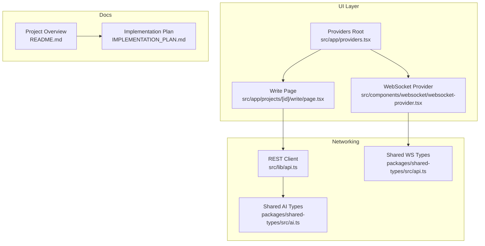

**Diagram sources**
- [src/app/projects/[id]/write/page.tsx](file://src/app/projects/[id]/write/page.tsx#L1-L626)
- [src/components/websocket/websocket-provider.tsx](file://src/components/websocket/websocket-provider.tsx#L1-L138)
- [src/app/providers.tsx](file://src/app/providers.tsx#L1-L37)
- [src/lib/api.ts](file://src/lib/api.ts#L1-L67)
- [packages/shared-types/src/ai.ts](file://packages/shared-types/src/ai.ts#L1-L383)
- [packages/shared-types/src/api.ts](file://packages/shared-types/src/api.ts#L62-L121)
- [README.md](file://README.md#L1-L426)
- [IMPLEMENTATION_PLAN.md](file://IMPLEMENTATION_PLAN.md#L230-L429)

**Section sources**
- [README.md](file://README.md#L1-L426)
- [IMPLEMENTATION_PLAN.md](file://IMPLEMENTATION_PLAN.md#L230-L429)
- [src/app/projects/[id]/write/page.tsx](file://src/app/projects/[id]/write/page.tsx#L1-L626)
- [src/components/websocket/websocket-provider.tsx](file://src/components/websocket/websocket-provider.tsx#L1-L138)
- [src/app/providers.tsx](file://src/app/providers.tsx#L1-L37)
- [src/lib/api.ts](file://src/lib/api.ts#L1-L67)
- [packages/shared-types/src/ai.ts](file://packages/shared-types/src/ai.ts#L1-L383)
- [packages/shared-types/src/api.ts](file://packages/shared-types/src/api.ts#L62-L121)

## Core Components
- Rich text editor with contentEditable and toolbar commands for formatting.
- AI assistant panel with three personas (Muse, Editor, Coach) and quick actions.
- Auto-save and manual save controls with version tracking.
- Sidebar for chapter navigation, scene metadata, and quick stats.
- WebSocket provider for real-time collaboration (placeholder for future features).
- REST API client with automatic token refresh and retry logic.
- Shared type definitions for AI intents, personas, collaboration messages, and export formats.

**Section sources**
- [src/app/projects/[id]/write/page.tsx](file://src/app/projects/[id]/write/page.tsx#L100-L626)
- [src/components/websocket/websocket-provider.tsx](file://src/components/websocket/websocket-provider.tsx#L1-L138)
- [src/lib/api.ts](file://src/lib/api.ts#L1-L67)
- [packages/shared-types/src/ai.ts](file://packages/shared-types/src/ai.ts#L1-L383)
- [packages/shared-types/src/api.ts](file://packages/shared-types/src/api.ts#L62-L121)

## Architecture Overview
The writing workspace combines a React-based rich text editor with a modular architecture supporting AI generation, real-time collaboration, and export. The editor integrates with a WebSocket provider for future collaboration features and a REST client for persistence and authentication. Shared type definitions define AI intents, personas, and collaboration message contracts.

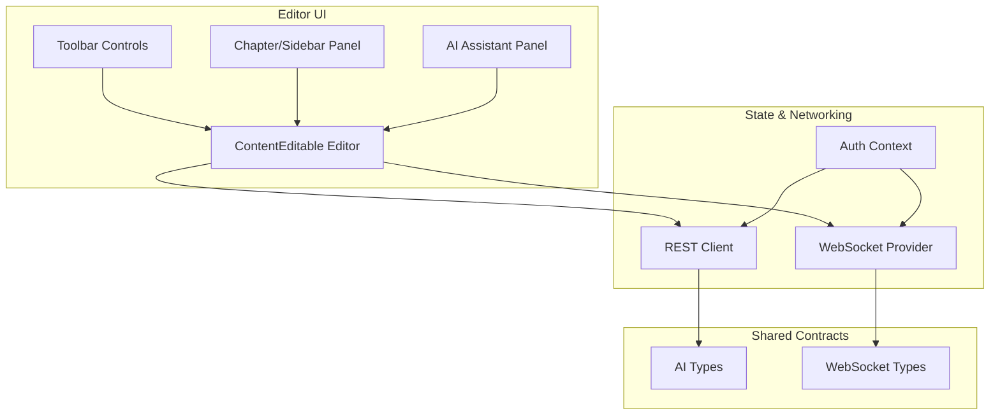

**Diagram sources**
- [src/app/projects/[id]/write/page.tsx](file://src/app/projects/[id]/write/page.tsx#L187-L349)
- [src/components/websocket/websocket-provider.tsx](file://src/components/websocket/websocket-provider.tsx#L17-L130)
- [src/lib/api.ts](file://src/lib/api.ts#L1-L67)
- [packages/shared-types/src/ai.ts](file://packages/shared-types/src/ai.ts#L1-L383)
- [packages/shared-types/src/api.ts](file://packages/shared-types/src/api.ts#L62-L121)

## Detailed Component Analysis

### Rich Text Editor and Formatting
The editor is implemented as a contentEditable div with a toolbar providing formatting commands. It calculates word counts, tracks selections, and supports auto-save and manual save. The toolbar exposes undo/redo, headings, bold/italic/underline, lists, blockquote, alignment, and version history access.

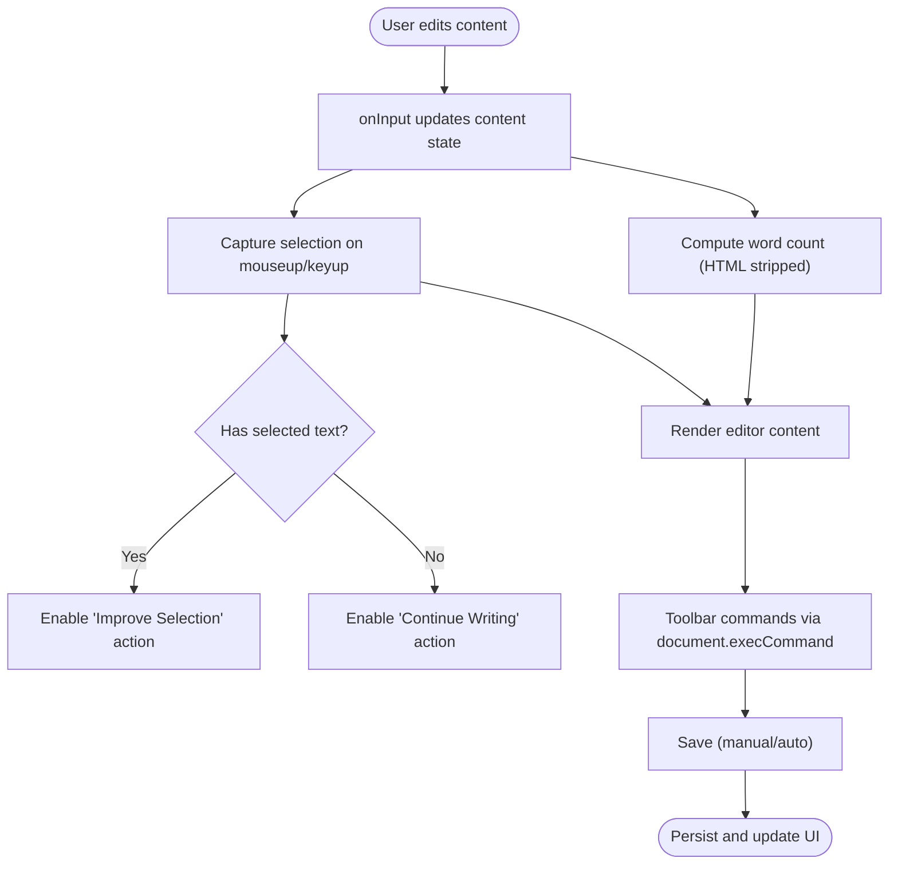

**Diagram sources**
- [src/app/projects/[id]/write/page.tsx](file://src/app/projects/[id]/write/page.tsx#L150-L180)
- [src/app/projects/[id]/write/page.tsx](file://src/app/projects/[id]/write/page.tsx#L168-L171)
- [src/app/projects/[id]/write/page.tsx](file://src/app/projects/[id]/write/page.tsx#L157-L166)

**Section sources**
- [src/app/projects/[id]/write/page.tsx](file://src/app/projects/[id]/write/page.tsx#L100-L626)

### AI Personas and Assistant Panel
The AI assistant panel allows selecting among three personas:
- Muse: creative inspiration and ideas
- Editor: grammar and style improvements
- Coach: story structure and pacing

The panel offers quick actions (e.g., improve selection, generate dialogue, describe scene, character voice check), a custom prompt area, and recent suggestions.

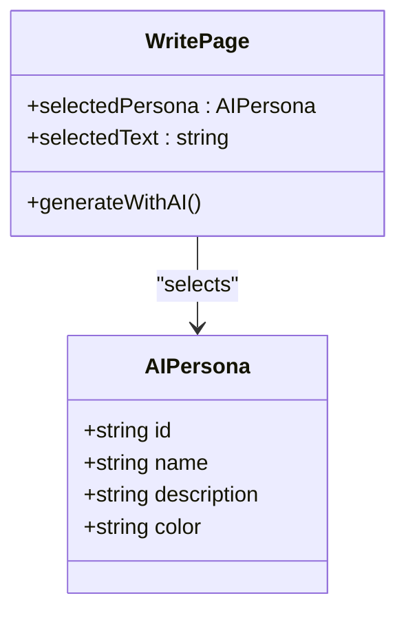

**Diagram sources**
- [src/app/projects/[id]/write/page.tsx](file://src/app/projects/[id]/write/page.tsx#L68-L98)
- [src/app/projects/[id]/write/page.tsx](file://src/app/projects/[id]/write/page.tsx#L182-L185)

**Section sources**
- [src/app/projects/[id]/write/page.tsx](file://src/app/projects/[id]/write/page.tsx#L68-L98)
- [src/app/projects/[id]/write/page.tsx](file://src/app/projects/[id]/write/page.tsx#L517-L622)

### AI Intents and Orchestration (Types)
Shared types define AI intents grouped by persona and parameters for generation orchestration. These types inform how the editor will route requests to AI services and manage streaming responses.

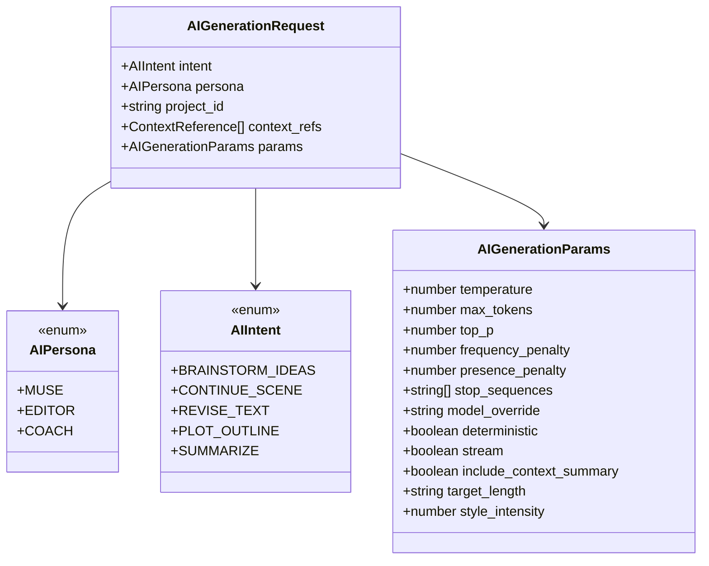

**Diagram sources**
- [packages/shared-types/src/ai.ts](file://packages/shared-types/src/ai.ts#L3-L11)
- [packages/shared-types/src/ai.ts](file://packages/shared-types/src/ai.ts#L77-L90)
- [packages/shared-types/src/ai.ts](file://packages/shared-types/src/ai.ts#L71-L75)
- [packages/shared-types/src/ai.ts](file://packages/shared-types/src/ai.ts#L33-L68)

**Section sources**
- [packages/shared-types/src/ai.ts](file://packages/shared-types/src/ai.ts#L1-L383)

### Real-time Collaboration and Presence
A WebSocket provider is present and establishes connections with authentication. The shared types define collaboration message types and presence updates, enabling future features like cursor presence, collaborative editing, comments, and activity feeds.

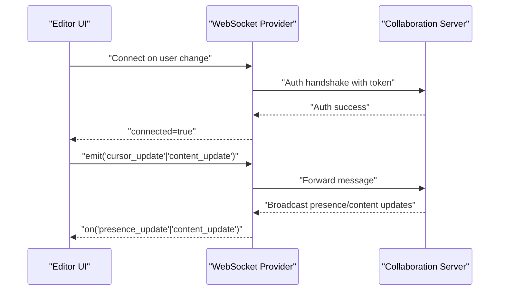

**Diagram sources**
- [src/components/websocket/websocket-provider.tsx](file://src/components/websocket/websocket-provider.tsx#L24-L93)
- [packages/shared-types/src/api.ts](file://packages/shared-types/src/api.ts#L115-L155)

**Section sources**
- [src/components/websocket/websocket-provider.tsx](file://src/components/websocket/websocket-provider.tsx#L1-L138)
- [packages/shared-types/src/api.ts](file://packages/shared-types/src/api.ts#L62-L121)
- [packages/shared-types/src/api.ts](file://packages/shared-types/src/api.ts#L123-L155)

### Version Control and Content History
The editor displays the current version and provides a toggle to show version history. The sidebar shows quick stats including word count and reading time. Versioning is represented in the scene model and persisted via the API.

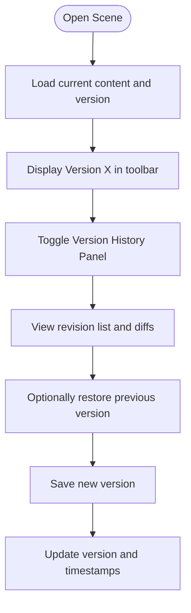

**Diagram sources**
- [src/app/projects/[id]/write/page.tsx](file://src/app/projects/[id]/write/page.tsx#L114-L135)
- [src/app/projects/[id]/write/page.tsx](file://src/app/projects/[id]/write/page.tsx#L314-L318)

**Section sources**
- [src/app/projects/[id]/write/page.tsx](file://src/app/projects/[id]/write/page.tsx#L114-L135)
- [src/app/projects/[id]/write/page.tsx](file://src/app/projects/[id]/write/page.tsx#L314-L318)

### Export Functionality
Export types define supported formats (JSON, ePub, PDF, DOCX, Markdown, HTML, LaTeX, Scrivener, Final Draft) and options such as metadata inclusion, table of contents, page sizes, and placeholder modes. Export jobs track progress and status.

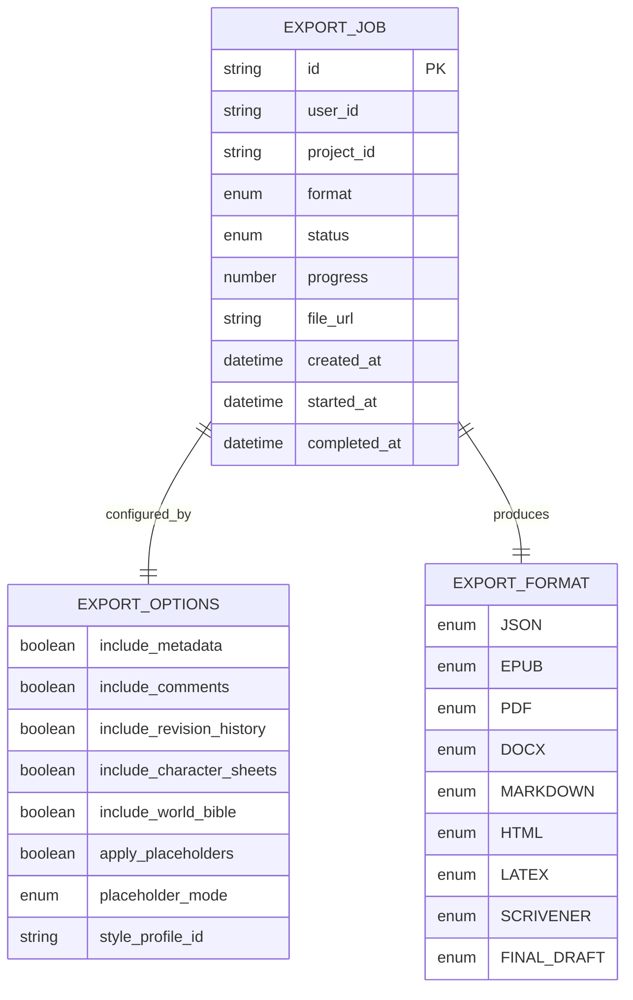

**Diagram sources**
- [packages/shared-types/src/api.ts](file://packages/shared-types/src/api.ts#L157-L242)
- [packages/shared-types/src/api.ts](file://packages/shared-types/src/api.ts#L163-L173)
- [packages/shared-types/src/api.ts](file://packages/shared-types/src/api.ts#L175-L216)

**Section sources**
- [packages/shared-types/src/api.ts](file://packages/shared-types/src/api.ts#L157-L242)
- [packages/shared-types/src/api.ts](file://packages/shared-types/src/api.ts#L163-L173)
- [packages/shared-types/src/api.ts](file://packages/shared-types/src/api.ts#L175-L216)

### AI-Assisted Writing Workflows
- Select persona and optionally select text to improve.
- Use quick actions (e.g., improve selection, continue writing, describe scene).
- Submit custom prompts for specialized requests.
- Review recent suggestions and accept or refine.

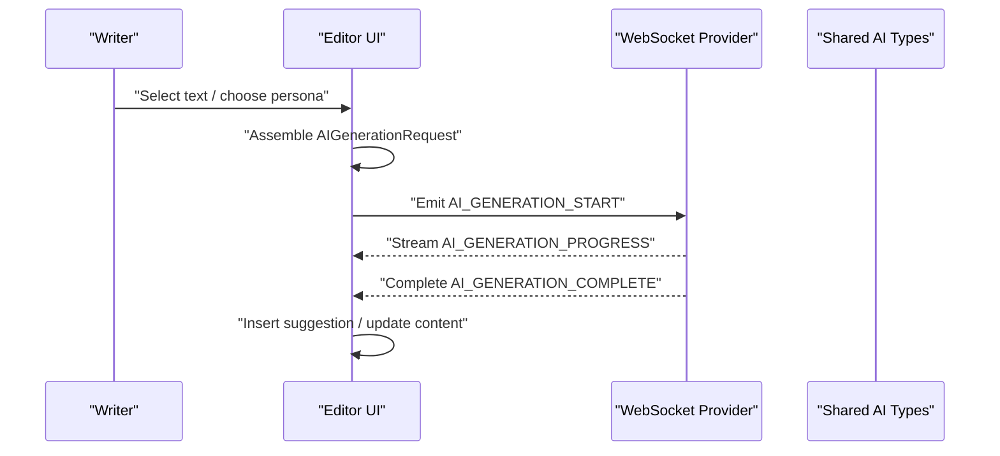

**Diagram sources**
- [src/app/projects/[id]/write/page.tsx](file://src/app/projects/[id]/write/page.tsx#L182-L185)
- [packages/shared-types/src/ai.ts](file://packages/shared-types/src/ai.ts#L3-L11)
- [packages/shared-types/src/api.ts](file://packages/shared-types/src/api.ts#L112-L117)

**Section sources**
- [src/app/projects/[id]/write/page.tsx](file://src/app/projects/[id]/write/page.tsx#L560-L602)
- [packages/shared-types/src/ai.ts](file://packages/shared-types/src/ai.ts#L3-L11)
- [packages/shared-types/src/api.ts](file://packages/shared-types/src/api.ts#L112-L117)

### Collaborative Editing (Planned)
- Cursor presence and selection broadcasting.
- Operational transformation or CRDT for collaborative editing.
- Comments and activity feed.
- Presence indicators and typing indicators.

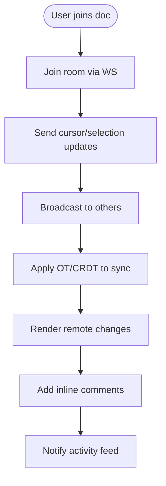

**Diagram sources**
- [IMPLEMENTATION_PLAN.md](file://IMPLEMENTATION_PLAN.md#L275-L314)
- [packages/shared-types/src/api.ts](file://packages/shared-types/src/api.ts#L102-L111)

**Section sources**
- [IMPLEMENTATION_PLAN.md](file://IMPLEMENTATION_PLAN.md#L275-L314)
- [packages/shared-types/src/api.ts](file://packages/shared-types/src/api.ts#L102-L111)

## Dependency Analysis
The editor depends on the REST client for persistence and authentication, the WebSocket provider for real-time features, and shared types for AI and collaboration contracts. Providers wrap the app with theme, query client, and auth contexts.

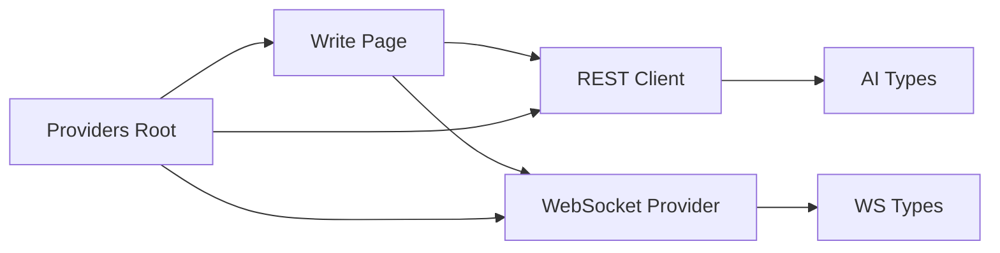

**Diagram sources**
- [src/app/projects/[id]/write/page.tsx](file://src/app/projects/[id]/write/page.tsx#L1-L626)
- [src/lib/api.ts](file://src/lib/api.ts#L1-L67)
- [src/components/websocket/websocket-provider.tsx](file://src/components/websocket/websocket-provider.tsx#L1-L138)
- [packages/shared-types/src/ai.ts](file://packages/shared-types/src/ai.ts#L1-L383)
- [packages/shared-types/src/api.ts](file://packages/shared-types/src/api.ts#L62-L121)
- [src/app/providers.tsx](file://src/app/providers.tsx#L9-L36)

**Section sources**
- [src/app/projects/[id]/write/page.tsx](file://src/app/projects/[id]/write/page.tsx#L1-L626)
- [src/lib/api.ts](file://src/lib/api.ts#L1-L67)
- [src/components/websocket/websocket-provider.tsx](file://src/components/websocket/websocket-provider.tsx#L1-L138)
- [src/app/providers.tsx](file://src/app/providers.tsx#L1-L37)
- [packages/shared-types/src/ai.ts](file://packages/shared-types/src/ai.ts#L1-L383)
- [packages/shared-types/src/api.ts](file://packages/shared-types/src/api.ts#L62-L121)

## Performance Considerations
- Debounce auto-save to reduce network load.
- Virtualize long contentEditable regions if needed.
- Use streaming responses for AI generation to minimize perceived latency.
- Optimize reflows by batching DOM updates.
- Lazy-load AI suggestions and export panels.
- Implement skeleton loaders for slow operations.

## Troubleshooting Guide
- WebSocket authentication failures: Verify cookie-based token presence and server-side auth middleware.
- Auto-save not triggering: Confirm autoSaveEnabled state and useEffect dependencies.
- Toolbar commands not applying: Ensure contentEditable is focused and execCommand is called after user interaction.
- Token refresh loops: Check refresh endpoint availability and error handling in the REST client.

**Section sources**
- [src/components/websocket/websocket-provider.tsx](file://src/components/websocket/websocket-provider.tsx#L36-L47)
- [src/components/websocket/websocket-provider.tsx](file://src/components/websocket/websocket-provider.tsx#L82-L86)
- [src/lib/api.ts](file://src/lib/api.ts#L24-L65)
- [src/app/projects/[id]/write/page.tsx](file://src/app/projects/[id]/write/page.tsx#L139-L148)
- [src/app/projects/[id]/write/page.tsx](file://src/app/projects/[id]/write/page.tsx#L168-L171)

## Conclusion
The writing workspace provides a solid foundation for a rich text editor integrated with AI assistance and real-time collaboration. The editor’s UI, persona-driven workflows, and versioning are implemented, while collaboration, AI orchestration, and export systems are defined in shared types and implementation plans. By following the outlined architecture and troubleshooting steps, teams can progressively implement advanced features while maintaining performance and accessibility.

## Appendices
- Implementation roadmap and tasks for AI, collaboration, and export are documented in the implementation plan.
- Project overview and current status are described in the README.

**Section sources**
- [IMPLEMENTATION_PLAN.md](file://IMPLEMENTATION_PLAN.md#L230-L429)
- [README.md](file://README.md#L159-L187)