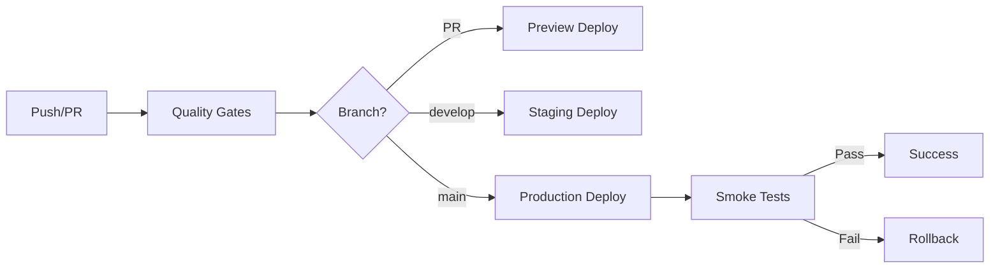

# 🚀 WorldBest Deployment Guide

## Overview

This guide covers the complete deployment process for the WorldBest platform, from local development to production deployment on Vercel with Docker support.

## Table of Contents

1. [Prerequisites](#prerequisites)
2. [Local Development](#local-development)
3. [Docker Deployment](#docker-deployment)
4. [Vercel Deployment](#vercel-deployment)
5. [Environment Configuration](#environment-configuration)
6. [CI/CD Pipeline](#cicd-pipeline)
7. [Monitoring & Health Checks](#monitoring--health-checks)
8. [Troubleshooting](#troubleshooting)

---

## Prerequisites

### Required Software

- **Node.js** >= 18.0.0
- **pnpm** >= 8.10.0
- **Docker** (optional, for containerized deployment)
- **Git**

### Installation

```bash
# Install Node.js (using nvm)
curl -o- https://raw.githubusercontent.com/nvm-sh/nvm/v0.39.0/install.sh | bash
nvm install 18
nvm use 18

# Install pnpm
npm install -g pnpm@8.10.0

# Verify installations
node -v   # Should be >= 18.0.0
pnpm -v   # Should be >= 8.10.0
```

---

## Local Development

### 1. Clone Repository

```bash
git clone <repository-url>
cd worldbest-deploy
```

### 2. Install Dependencies

```bash
pnpm install --frozen-lockfile
```

### 3. Configure Environment

```bash
# Copy environment template
cp .env.example .env.local

# Edit .env.local with your configuration
# Required variables:
# - POSTGRES_URL
# - NEXT_PUBLIC_SUPABASE_URL
# - NEXT_PUBLIC_SUPABASE_ANON_KEY
```

### 4. Run Development Server

```bash
pnpm dev
```

Visit: http://localhost:3000

### 5. Validate Configuration

```bash
# Run deployment validation script
./validate-deployment.sh
```

---

## Docker Deployment

### Build Docker Image

```bash
# Build the image
docker build -t worldbest:latest .

# Verify image
docker images | grep worldbest
```

### Run Container

```bash
# Run with environment variables
docker run -d \
  --name worldbest \
  -p 3000:3000 \
  --env-file .env.local \
  worldbest:latest

# Check container health
docker ps
curl http://localhost:3000/api/health
```

### Docker Compose (Optional)

Create `docker-compose.yml`:

```yaml
version: '3.8'

services:
  app:
    build: .
    ports:
      - "3000:3000"
    env_file:
      - .env.local
    healthcheck:
      test: ["CMD", "curl", "-f", "http://localhost:3000/api/health"]
      interval: 30s
      timeout: 10s
      retries: 3
      start_period: 40s
```

Run with:

```bash
docker-compose up -d
```

---

## Vercel Deployment

### Prerequisites

1. **Vercel Account**: Sign up at https://vercel.com
2. **GitHub Repository**: Connected to Vercel

### Setup

#### 1. Install Vercel CLI (Optional)

```bash
npm install -g vercel
vercel login
```

#### 2. Link Project

```bash
vercel link
```

#### 3. Configure Environment Variables

In Vercel Dashboard:
1. Go to Project Settings → Environment Variables
2. Add all variables from `.env.example`
3. Configure per environment (Development, Preview, Production)

**Critical Variables:**

| Variable | Scope | Required |
|----------|-------|----------|
| `POSTGRES_URL` | Production | ✅ |
| `NEXT_PUBLIC_SUPABASE_URL` | All | ✅ |
| `NEXT_PUBLIC_SUPABASE_ANON_KEY` | All | ✅ |
| `SUPABASE_SERVICE_ROLE_KEY` | Production | ✅ |
| `CRON_SECRET` | Production | ✅ |
| `STRIPE_SECRET_KEY` | Production | ⚠️ (when payments enabled) |

#### 4. GitHub Integration

**Automatic Deployments:**

- **Pull Request** → Preview Deployment
- **Push to `develop`** → Staging Deployment
- **Push to `main`** → Production Deployment

### Manual Deployment

```bash
# Deploy to production
vercel --prod

# Deploy to preview
vercel
```

---

## Environment Configuration

### Environment Files

| File | Purpose | Committed |
|------|---------|-----------|
| `.env.example` | Template with all variables | ✅ Yes |
| `.env.local` | Local development | ❌ No |
| `.env.production` | Production overrides | ❌ No |

### Variable Categories

#### 1. Database (Supabase)

```bash
POSTGRES_URL="postgres://..."
POSTGRES_PRISMA_URL="postgres://..."
POSTGRES_URL_NON_POOLING="postgres://..."
SUPABASE_JWT_SECRET="..."
SUPABASE_SERVICE_ROLE_KEY="..."
```

#### 2. Public Variables

```bash
NEXT_PUBLIC_SUPABASE_URL="https://..."
NEXT_PUBLIC_SUPABASE_ANON_KEY="..."
NEXT_PUBLIC_API_URL="https://..."
NEXT_PUBLIC_APP_URL="https://worldbest.vercel.app"
```

#### 3. Third-Party Services

```bash
# Stripe
STRIPE_SECRET_KEY="sk_live_..."
STRIPE_WEBHOOK_SECRET="whsec_..."

# Analytics
NEXT_PUBLIC_GA_MEASUREMENT_ID="G-..."
SENTRY_DSN="https://..."

# OpenAI
OPENAI_API_KEY="sk-..."
```

#### 4. Security

```bash
CRON_SECRET="your-secure-random-string"
```

---

## CI/CD Pipeline

### GitHub Actions Workflow

Located at: `.github/workflows/ci-cd.yml`

### Pipeline Stages



### Quality Gates

1. **ESLint** - Code quality
2. **TypeScript** - Type checking
3. **Build** - Application compilation
4. **Bundle Size** - <350KB limit

### Required GitHub Secrets

Add in Repository Settings → Secrets:

```bash
VERCEL_TOKEN          # From Vercel Account Settings
VERCEL_ORG_ID         # From Vercel Project Settings
VERCEL_PROJECT_ID     # From Vercel Project Settings
```

---

## Monitoring & Health Checks

### Health Check Endpoint

**URL**: `/api/health`

**Response**:

```json
{
  "status": "healthy",
  "timestamp": "2025-10-22T10:30:00.000Z",
  "uptime": 123456,
  "environment": "production",
  "version": "1.0.0",
  "checks": {
    "server": "ok",
    "memory": "ok"
  }
}
```

### Cron Jobs

#### 1. Cleanup Job

- **Schedule**: Daily at 2 AM UTC
- **Endpoint**: `/api/cron/cleanup`
- **Tasks**: Session cleanup, temp files, data archival

#### 2. Analytics Job

- **Schedule**: Every 6 hours
- **Endpoint**: `/api/cron/analytics`
- **Tasks**: Metrics aggregation, KPI updates

### Monitoring Tools

1. **Vercel Analytics** - Performance metrics
2. **Sentry** - Error tracking (when configured)
3. **UptimeRobot** - Uptime monitoring (when configured)

---

## Troubleshooting

### Common Issues

#### 1. Build Fails on Vercel

**Symptom**: Build fails with dependency errors

**Solution**:
```bash
# Clear Vercel cache
vercel --force

# Verify package.json and pnpm-lock.yaml are committed
git status
```

#### 2. Docker Build Fails

**Symptom**: "apps/web not found" error

**Solution**: Ensure Dockerfile uses correct paths (root structure, not `apps/web`)

#### 3. Health Check Fails

**Symptom**: `/api/health` returns 404

**Solution**:
```bash
# Verify route file exists
ls src/app/api/health/route.ts

# Rebuild application
pnpm build
```

#### 4. Environment Variables Not Loading

**Symptom**: Variables undefined in application

**Solution**:
- Verify variables are set in Vercel Dashboard
- Check variable naming (`NEXT_PUBLIC_` prefix for client-side)
- Redeploy after adding new variables

### Deployment Checklist

- [ ] All environment variables configured
- [ ] Database connection tested
- [ ] Build completes successfully
- [ ] Health check endpoint responds
- [ ] No TypeScript errors
- [ ] Bundle size within budget
- [ ] Security headers configured
- [ ] Analytics tracking works
- [ ] Error monitoring active

### Support

For deployment issues:
1. Check build logs in Vercel Dashboard
2. Verify environment variables
3. Run `./validate-deployment.sh` locally
4. Review GitHub Actions workflow logs

---

## Production Readiness

### Before Going Live

1. **Security**
   - [ ] All secrets rotated for production
   - [ ] HTTPS enforced
   - [ ] Security headers configured
   - [ ] Rate limiting enabled

2. **Performance**
   - [ ] Lighthouse score ≥90
   - [ ] Images optimized
   - [ ] Caching configured
   - [ ] CDN enabled

3. **Monitoring**
   - [ ] Error tracking active
   - [ ] Uptime monitoring configured
   - [ ] Analytics integrated
   - [ ] Alerts configured

4. **Business**
   - [ ] Payment integration tested
   - [ ] Email notifications working
   - [ ] Terms of Service published
   - [ ] Privacy Policy published

---

## Next Steps

After successful deployment:

1. **Monitor** - Check Vercel Analytics and health endpoint
2. **Test** - Verify critical user flows
3. **Optimize** - Review performance metrics
4. **Scale** - Adjust resources based on traffic

---

**Last Updated**: 2025-10-22  
**Version**: 1.0.0
